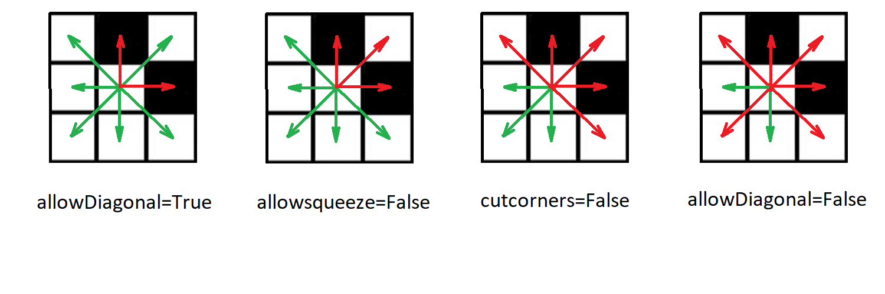
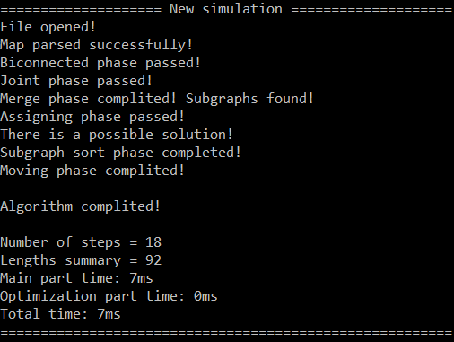
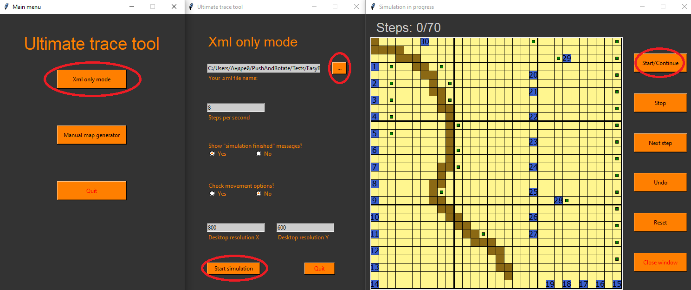

# PushAndRotate

В этом проекте содержится реализация алгоритма Push and Rotate - в обычной и параллельной версии.

Push and Rotate позволяет гарантированно находить некое решение задачи многоагентного планирования (MAPF), получая субоптимальные решения значительно быстрее большинства других алгоритмов. В случае, если задачу решить невозможно, алгоритм явно сообщит об этом.

Алгоритм разработан Boris de Wilde, Adriaan W. ter Mors, Cees Witteveen (Push and Rotate: a Complete Multi-agent Pathfinding Algorithm, 2014).

Оригинальная статья:
https://www.jair.org/index.php/jair/article/view/10913/26020

# Реализация
В папке `Algorithm` находится код обеих версий на C++17, готовый к компиляции при помощи CMAKE под любой основной операционной системой. Как и в других алгоритмах MAPF, на вход программе подаётся прямоугольная grid-карта с расположенными на ней агентами, для которых определены координаты старта и финиша. Входные данные представляют из себя .xml файл следующего формата:
+ Весь файл оборачивается в тег `root`.
+ В теге `root` распологается тег `map`, где и будут определяться входные данные.
+ В теге `map` определены размеры карты - теги `width` и `height`.
+ Затем идёт описание агентов в теге `agents`. Каждый агент задаётся своим номером (атрибут `id` - число от `1` до `N`, где `N` - число агентов на карте), своим стартом (при помощи координат `startx` и `starty`), а также финишем (координаты `finishx` и `finishy`).
+ Затем идёт описание препятствий, т.е. самой карты. Она находится в теге `grid`, и разделена на ряды (`row`), а сами ряды представляют из себя последовательность нулей и единиц, где `0` означает свободную клетку, а `1` - занятую препятствием.
+ И наконец, описываются правила, по которым можно ходить по карте. Всего имеются 3 тега - `allowdiagonal`, `cutcorners` и `allowsqueeze`, которые определяют, какие клетки будут являться соседними. Подробности - на иллюстрации:


Пример такого файла можно найти в `Tests\BasicBenchmarks\1.xml`.

Программа, получая на вход карту, создаёт копию входного файла, дописывая туда ответ:
+ Тег `log` с решением добавляется после тега `map`. 
+ В нём находятся теги `general` и `paths`.
+ В теге `general` находится общая информация о полученном решении. Так тег `makespan` содержит общее число шагов в решении, тег `summ-of-costs` - сумму длин всех путей, а теги `moving phase time` и `post-processing-time` - время, потраченное на выполнение базовой части и оптимизационной части соответственно (в миллисекундах). Затем времена суммируются в теге `total-time`.
+ Затем идёт описание траекторий агентов в теге `paths`. Описание распределено по агентам (тег `agent` со своим атрибубом `id`).
+ Каждое движение агента на одну клетку оборачивается тегом `movement` с атрибуиами `step` - шаг, на котором агент совершает движение; `x` и `y` - координаты точки назначения.

Пример этого формата можно найти в `Tests\BasicBenchmarks-solved\1.xml`. В свою очередь, этот файл является решённой копией входных данных из `Tests\BasicBenchmarks\1.xml`.

# Компиляция и запуск

Для компиляции программы необходима поддержка C++14, CMAKE 3.2 или выше.

Компиляция под Linux и Mac:
```cmd
mkdir Build
cd Build
cmake ../ -DCMAKE_BUILD_TYPE="Release"
make
make install
cd ..
```
Компиляция под Windows:
```cmd
mkdir Build
cd Build
set PATH
cmake ../ -DCMAKE_BUILD_TYPE="Release" -G "MinGW Makefiles"
mingw32-make
mingw32-make install
cd ..
```
После компиляции создастся папка Bin с бинарным файлом проекта. Для запуска программы необходимо запустить этот файл передав ему в аргументах командной строки:
+ Имя входного файла (.xml) описанного выше формата
+ Имя выходного файла (создастся самомтоятельно)
+ В случае оригинальной версии алгоритма больше ничего указывать не нужно. В случае параллельной версии необходимо добавить `parallel` третьим аргументом.

Так, например, для запуска решения параллельной версии алгоритма для `Tests\BasicBenchmarks\1.xml` необходимо ввести (под Linux):
```cmd
./Bin/PushAndRotate Tests/BasicBenchmarks/1.xml Tests/BasicBenchmarks-solved/1.xml parallel
```
В результате программа перезапишет файл `Tests/BasicBenchmarks-solved/1.xml`. А в командную строку будут выведены следующие логи:



# Массовый запуск
Есть возможность запустить решение нескольких файлов одновременно при помощи одной команды. Для этого можно использовать скрипт `mass_execution.py`, который запускает выбранный алгоритм на всех файлах в директории, и создаёт папку вида `{Name}-solved`, которая помещается рядом с выбранной.

Так, например, для запуска решения оригинальной версии алгоритма для папки `Tests\BasicBenchmarks` под Linux необходимо использовать слудующую команду:
```cmd
python3 mass_execution.py Tests/BasicBenchmarks
```
Тогда создастся или перезапишется папка с решениями `Tests/BasicBenchmarks-solved`, где будут собраны полученные ответы. В конце в командную строку будет выведен краткий отчёт о качестве решений и затраченном времени.

# Визуализация ответа
Помимо встроенной проверки на корректность, есть возможность визуализировать ответ. Для этого понадобится python 3 со следующими пакетами (к сожалению, нужно установить отдельно):
+ `Tkinter` для python 3 - https://docs.python.org/3/library/tkinter.html
+ `Element tree` - https://docs.python.org/3/library/xml.etree.elementtree.html
+ `Python xml minidom` - https://docs.python.org/3/library/xml.dom.minidom.html

Для запуска симуляции необходимо:
+ Открыть файл `Generators/tool.py`
+ Затем выбрать вариант `Xml only mode`
+ Затем выбрать любой файл из `Tests\BasicBenchmarks-solved` или любой другой файл того же формата
+ И нажать `Start simulation`


В правом окне показан интерфейс визуализатора. Решение можно прогнать по ходам, просто запустить, остановить, начать заново, или откатить назад на несколько шагов при помощи соответствующих кнопок.

При этом скрипт ещё раз проверит ответ на корректность. В случае, если был получен неправильный ответ, симуляция остановится на проблемном месте и сообщит тип ошибки.
