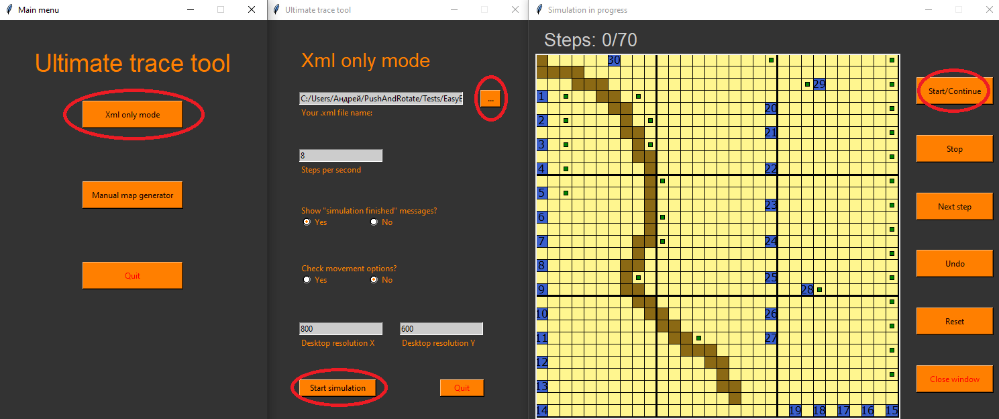

# PushAndRotate

В этом проекте содержится реализация алгоритма Push and Rotate (в обычной и параллельной версиях), а также приоритезированного подхода.

В папке `Algorithm` находится код обеих программ на C++17, готовый к компиляции при помощи CMAKE под любой основной операционной системой.
На вход программе подаётся: 
+ .xml файл специального формата(представленный в папке `Tests\BasicBencmarks` и `Tests\EasyBenchmarks`)
+ Имя выходного файла
+ Набор опция для определения типа алгоритма

На выходе получается немного модифицированный файл с ответом. При этом производится автоматическая проверка на корректность полученного ответа. В случае, если программа дала неверный ответ или не смогла найти решение, об этом будет сообщено на stdin.

Запуск решения производится при помощи `.py` скрипта `mass_execution.py`, который запускает выбранный алгоритм на всех файлах в директории. Для корректной работы программы необходима поддержка CMAKE и python 3. Так, например, для запуска решения для папки `Tests\EasyBenchmarks` под linux необходимо использовать слудующие команды:
```cmd
mkdir Build
cd Build
cmake ../ -DCMAKE_BUILD_TYPE="Release"
make
make install
cd ..
python3 mass_execution.py Tests/EasyBenchmarks parallel priorities
```
Тогда перезапишется папка с решениями `Tests/EasyBenchmarks-solved`, где будут собранны решения, полученные при помощи parallel push and rotate и приоритезированного подхода. Чтобы не применять приоритезированный подход, необходимо убрать `priorities` из последней команды. Чтобы получить решение для оригинального push and rotate, необходимо убрать опцию parallel.

# Визуализация ответа
Помимо встроенной проверки на корректность, есть возможность визуализировать ответ. Для этого понадобится python 3 с установленными пакетами `minidom` и `tkinter` (к сожалению, нужно установить отдельно).
+ Открываем файл `Generators/tool.py`:
+ Затем выбираем вариант `Xml only mode`
+ Затем выбираем любой файл из `Tests\EasyBenchmarks-solved`
+ И нажимаем `Start simulation`


При этом скрипт ещё раз проверит ответ на корректность. Таким образом, проверка получается двухэтапной, а значит, очень надёжной.

# Что уже сделано?
+ Реализован push and rotate в обычной и параллельной версии, а также приоритезированный подход (пока базовый). 
+ Написан визуализатор
+ Проведено тестирование push and rotate на ~50 своих тестов, а также на ~200 тестах с `movingai.com` со 100% решаемостью.

# Что предстоит сделать?
+ Довести до ума приоритезированный подход (aka использовать наработки с flatland challenge), что позволит решать хотя бы тесты с `movingai.com` (30 апреля).
+ Письменно оформить сравнение двух подходов, их преимущества и недостатки (6 мая).
